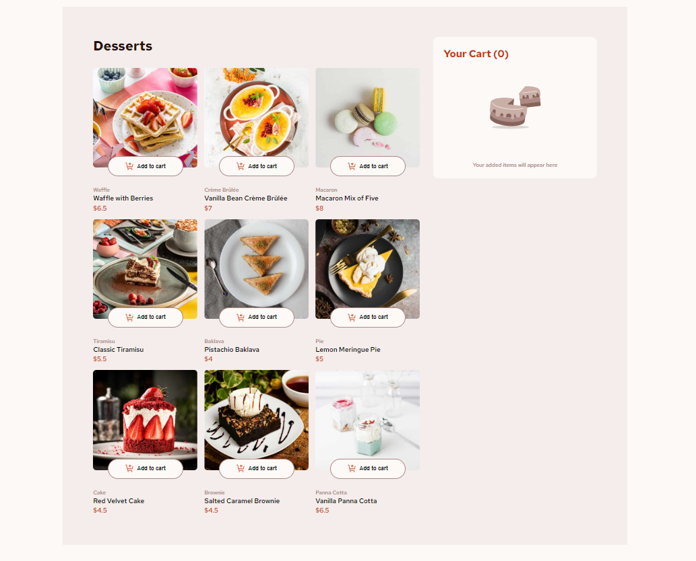
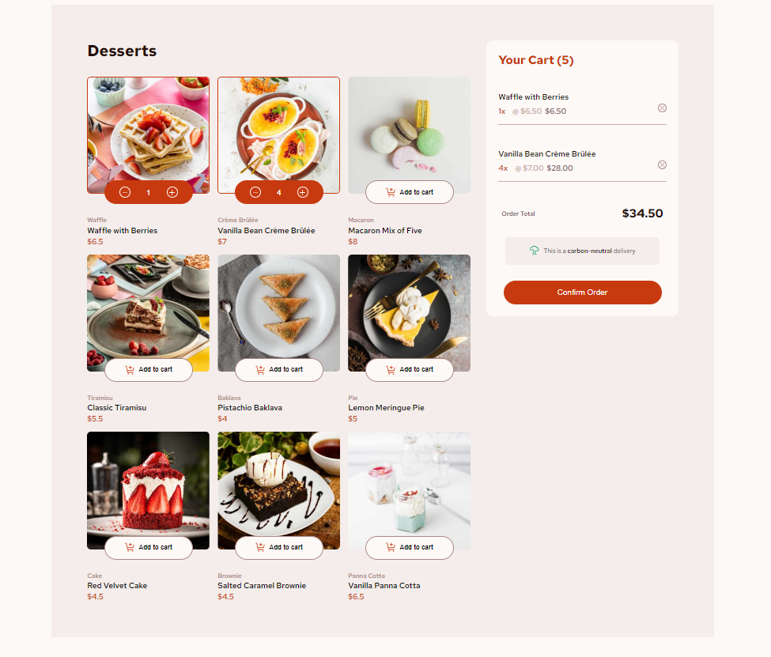
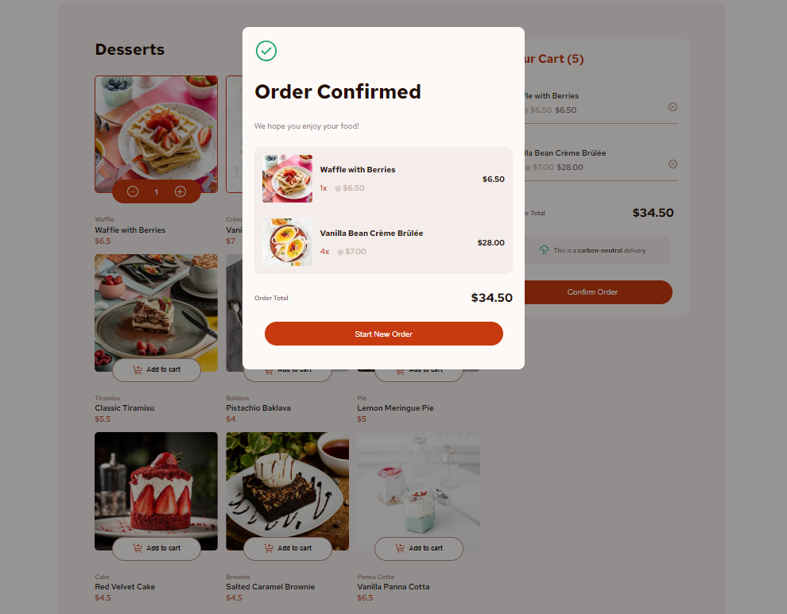
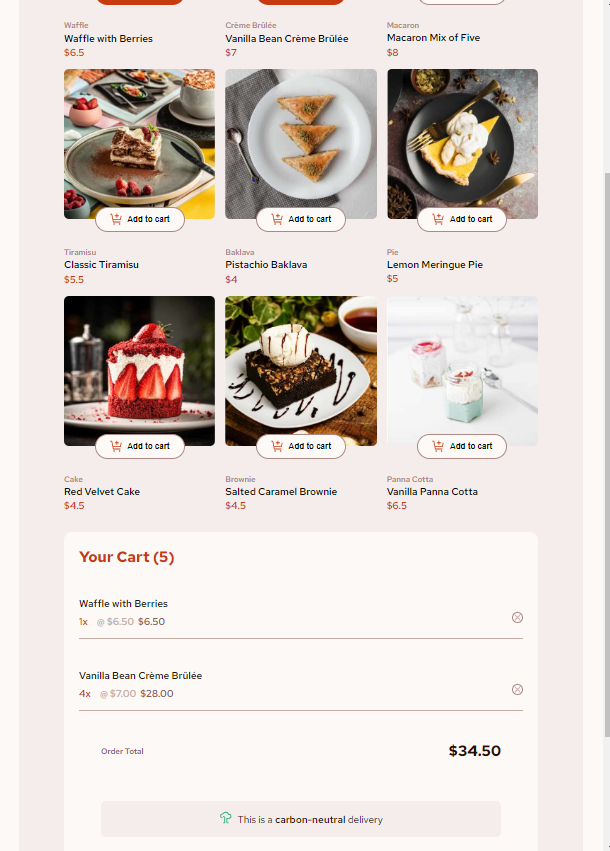
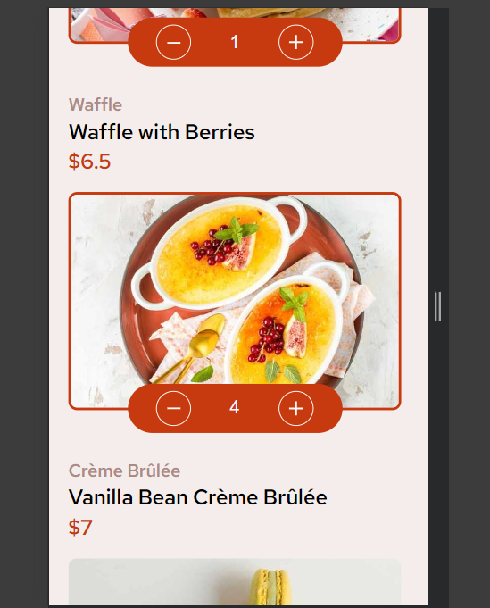

# Frontend Mentor - Product list with cart solution

This is a solution to the [Product list with cart challenge on Frontend Mentor](https://www.frontendmentor.io/challenges/product-list-with-cart-5MmqLVAp_d). Frontend Mentor challenges help you improve your coding skills by building realistic projects.

## Table of contents

- [Overview](#overview)
- [The challenge](#the-challenge)
- [Screenshot](#screenshot)
- [Built with](#built-with)

## Overview

### The challenge

Users should be able to:

- Add items to the cart and remove them
- Increase/decrease the number of items in the cart
- See an order confirmation modal when they click "Confirm Order"
- Reset their selections when they click "Start New Order"
- View the optimal layout for the interface depending on their device's screen size
- See hover and focus states for all interactive elements on the page

### Screenshot

### Links

- Solution URL: [Add solution URL here](https://your-solution-url.com)
- Live Site URL: [Add live site URL here](https://your-live-site-url.com)

## My process

### Built with

**React** - A JavaScript library for building user interfaces. Utilizes component-based architecture for reusable UI components.

- **Vite** - A build tool that offers a fast and lean development experience, allowing for rapid hot module replacement and efficient bundling.
- **Styled Components** - A library that enables you to write CSS in JavaScript, allowing for scoped styles that are tied directly to components.
- **ESLint** - A tool for identifying and fixing problems in JavaScript code, ensuring code quality and adherence to coding standards.
- **React Hooks** - Provides a way to use state and other React features without writing a class, making functional components more powerful.
- **Local Storage** - Utilized for persisting cart data, allowing users to retain their cart contents across page refreshes.
- **Context API** - Enables global state management, making it easy to share data across components without prop drilling.
- **JSON Data** - Uses local JSON data files for dessert menu items, simplifying data management and making it easy to add or modify items.
- **Responsive Design** - Built with mobile-first design principles in mind, ensuring a seamless experience across devices of all sizes.
